# VybePixie — Architecture

> Deep dive into the AI-native game & animation studio engine

---

## Table of Contents

- [System Overview](#system-overview)
- [Design Principles](#design-principles)
- [Application Layers](#application-layers)
- [Event-Sourcing Core](#event-sourcing-core)
- [12-Phase Engine](#12-phase-engine)
- [Frontend Architecture](#frontend-architecture)
- [Multi-Agent AI System](#multi-agent-ai-system)
- [Game Pipeline](#game-pipeline)
- [Animation Engine](#animation-engine)
- [Audio Generation](#audio-generation)
- [Rendering Pipeline](#rendering-pipeline)
- [3D Generation Pipeline](#3d-generation-pipeline)
- [DCC Bridge System](#dcc-bridge-system)

---

## System Overview

VybePixie is a **Tauri hybrid desktop application** with three distinct runtime layers that together form a complete AI-powered game and animation studio:

1. **Rust Container** (Tauri) — Native OS integration, security sandboxing, file system access
2. **React Frontend** — 15+ workspace panels, real-time + path trace viewports, animation timeline, game systems editor
3. **Python Engine** — Event-sourced core, multi-agent AI orchestration, game pipeline, animation engine, audio generation, 3D pipelines, DCC bridges

```
┌─────────────────────────────────────────────────────────┐
│                    User's Desktop                        │
├─────────────────────────────────────────────────────────┤
│                                                          │
│  ┌───────────────────────────────┐                      │
│  │     Tauri Container (Rust)    │                      │
│  │  • Security sandbox           │                      │
│  │  • File I/O                   │                      │
│  │  • Native dialogs             │                      │
│  │  • IPC bridge                 │                      │
│  └──────────────┬────────────────┘                      │
│                 │                                        │
│     ┌───────────┴───────────┐                           │
│     ▼                       ▼                            │
│  ┌──────────────┐   ┌──────────────────────────┐       │
│  │ React + Three│   │  Python Engine            │       │
│  │              │   │                            │       │
│  │ • Real-Time  │   │  Event Store (SQLite)      │       │
│  │   + Path     │   │  12-Phase System           │       │
│  │   Trace      │   │  Multi-Agent AI (3 agents) │       │
│  │ • 15+ panels │   │  Game Pipeline             │       │
│  │ • Redux      │   │  Animation Engine          │       │
│  │ • Animation  │   │  Audio Generation          │       │
│  │   Timeline   │   │  3D Generation (PyTorch)   │       │
│  │ • Game       │   │  DCC Bridges               │       │
│  │   Systems    │   │                            │       │
│  └──────────────┘   └──────────────────────────┘       │
│                                                          │
│  ┌──────────────────────────────────────────────┐       │
│  │              GPU Layer                        │       │
│  │  • GL/ANGLE (real-time viewport)              │       │
│  │  • Path tracer (CPU/GPU ray tracing)          │       │
│  │  • CUDA/PyTorch (AI generation)               │       │
│  └──────────────────────────────────────────────┘       │
│                                                          │
└─────────────────────────────────────────────────────────┘
```

---

## Design Principles

| Principle | Implementation |
|-----------|---------------|
| **Determinism** | Same input → same output, guaranteed by canonical serialization + versioned hashing |
| **Event Sourcing** | All state derived from immutable event stream; current state = replay of events |
| **Content Addressing** | Every entity identified by SHA-256 hash of its canonical bytes |
| **Tamper Evidence** | Blockchain-style prev_hash + current_hash chaining in event ledger |
| **Non-Destructive** | Edits are layers, not mutations; full undo history preserved |
| **Phase Isolation** | 12 independent systems with clear boundaries and contracts |

---

## Event-Sourcing Core

The foundation of VybePixie. Every state change in the application is driven by an immutable event.

### How It Works

```
User Action (e.g., "generate mesh from prompt")
    │
    ▼
┌──────────────────────────────────────┐
│  1. Validate Input                    │
│     • Schema validation (Pydantic)    │
│     • Business rule checks            │
└──────────────┬───────────────────────┘
               │
               ▼
┌──────────────────────────────────────┐
│  2. Create Event                      │
│     • Deterministic ID (SHA-256)      │
│     • Canonical JSON serialization    │
│     • Compute event hash              │
│     • Chain to previous event hash    │
└──────────────┬───────────────────────┘
               │
               ▼
┌──────────────────────────────────────┐
│  3. Store in Event Ledger (SQLite)    │
│     • Append-only (no updates)        │
│     • Hash chain maintained           │
│     • Snapshot checkpoints for speed  │
└──────────────┬───────────────────────┘
               │
               ▼
┌──────────────────────────────────────┐
│  4. Replay to Derive State            │
│     • Sequential event replay         │
│     • Deterministic state rebuilding  │
│     • Snapshot-accelerated for perf   │
└──────────────────────────────────────┘
```

### Hash Chain Integrity

```
Event 1              Event 2              Event 3
┌──────────────┐    ┌──────────────┐    ┌──────────────┐
│ prev: null   │    │ prev: hash_1 │    │ prev: hash_2 │
│ data: {...}  │    │ data: {...}  │    │ data: {...}  │
│ hash: hash_1 │───→│ hash: hash_2 │───→│ hash: hash_3 │
└──────────────┘    └──────────────┘    └──────────────┘
```

If any event is tampered with, all subsequent hashes break — making unauthorized changes immediately detectable.

---

## 12-Phase Engine

The Python backend is organized into 12 independent phases, each handling a distinct domain:

```mermaid
graph LR
    P0[Phase 0<br>Core] --> P1[Phase 1<br>World]
    P1 --> P2[Phase 2<br>Assets]
    P2 --> P3[Phase 3<br>Edits]
    P3 --> P4[Phase 4<br>Planning]
    P4 --> P5[Phase 5<br>Generation]
    P5 --> P6[Phase 6<br>Assembly]
    P6 --> P7[Phase 7<br>Validation]
    P7 --> P8[Phase 8<br>Fixes]
    P8 --> P9[Phase 9<br>Procedural]
    P9 --> P10[Phase 10<br>Director]
    P10 --> P11[Phase 11<br>Ingestion]
    P11 --> P12[Phase 12<br>Bridges]
```



### Phase Details

| Phase | Module | Responsibility |
|-------|--------|---------------|
| **0** | `core/` | Determinism foundation — hashing, content-addressed IDs, event types, ledger, replay engine, logical time |
| **1** | `world/` | Scene graph — hierarchical nodes, transforms, spatial queries, world model |
| **2** | `assets/` | Content-addressable asset registry — versioning, provenance tracking, metadata |
| **3** | `edits/` | Non-destructive edit system — operations, layers, undo/redo history |
| **4** | `planning/` | Agent planning — budgets, task decomposition, approval workflows |
| **5** | `generation/` | AI generation pipelines — model invocation, cost tracking, quality validation |
| **6** | `assembly/` | Scene assembly — LOD management, asset linking, deterministic composition |
| **7** | `validation/` | 50+ validation rules — geometry checks, material validation, budget enforcement |
| **8** | `fixes/` | Auto-fix engine — intelligent corrections, governance gates, retry policies |
| **9** | `procedural/` | 50+ algorithms — noise, SDFs, L-systems, scatter, heightmaps, erosion simulation |
| **10** | `director/` | Multi-agent orchestration — Director, Producer, TD agents, intent parsing, multi-LLM routing |
| **11** | `ingestion/` | Data import — attribution tracking, gap detection, format conversion |
| **12** | `bridges/` | DCC integration — Blender, Maya, Houdini, 3DS Max bi-directional sync |

### Module Layout

```
src/vybepixie/
├── core/                    # Phase 0
│   ├── events/             # Event types, ledger, replay
│   ├── state/              # State reconstruction, snapshots
│   ├── hashing/            # Deterministic SHA-256
│   ├── ids/                # Content-addressed identifiers
│   ├── invariants/         # Determinism verification
│   └── time/               # Logical timestamps
├── world/                  # Phase 1 — Scene graph
├── assets/                 # Phase 2 — Asset registry
├── edits/                  # Phase 3 — Edit system
├── planning/               # Phase 4 — Planning
├── generation/             # Phase 5 — AI pipelines
├── assembly/               # Phase 6 — Scene composition
├── validation/             # Phase 7 — Quality control
├── fixes/                  # Phase 8 — Auto-fix
├── procedural/             # Phase 9 — Procedural generation
├── director/               # Phase 10 — Multi-agent orchestration
├── ingestion/              # Phase 11 — Data import
├── bridges/                # Phase 12 — DCC bridges
│   ├── blender/           # Blender 3.0–4.5 (real-time sync)
│   ├── maya/              # Maya 2018–2025
│   ├── houdini/           # Houdini
│   └── max/               # 3DS Max
├── game_pipeline/          # Prompt-to-game pipeline
│   ├── agent_game/        # Agentic game creation workflow
│   ├── scene_composer/    # Level building and layout
│   ├── game_logic/        # State machines, behavior trees, input
│   ├── multiplayer/       # Networking framework
│   ├── physics/           # Rigid body, ragdoll, world-scale
│   └── exporters/         # Godot, Unity, UE5 project export
├── animation_engine/       # Full animation studio
│   ├── library/           # Locomotion, combat, idle, emote, interaction
│   ├── blend_trees/       # Blend trees & state machine transitions
│   ├── ik_solver/         # Inverse kinematics (limb, foot, look-at)
│   ├── mocap/             # Motion capture import & retargeting
│   ├── secondary/         # Spring bones, cloth, tails, wings, hair
│   ├── facial/            # Blendshapes, facial rigging, lip sync
│   ├── ragdoll/           # Physics-driven character animation
│   └── events/            # Frame-triggered gameplay actions
├── audio/                  # Audio generation system
│   ├── voice/             # Multi-speaker TTS (ElevenLabs, PlayHT)
│   ├── music/             # AI music composition (Suno, Udio)
│   ├── ambient/           # Procedural environment soundscapes
│   └── effects/           # Granular synthesis, modulation, mixing
├── rendering/              # Dual rendering pipeline
│   ├── realtime/          # GL/ANGLE real-time viewport
│   ├── pathtracer/        # CPU/GPU ray tracing
│   ├── postprocess/       # Bloom, DoF, motion blur, color grading
│   └── xr/               # WebXR, ARKit, ARCore, Meta Quest
├── characters/            # Character & creature creation
│   ├── archetypes/        # Fantasy, Sci-Fi, Modern, Historical
│   ├── creatures/         # Non-human: robots, aliens, monsters
│   ├── factions/          # Faction-based grouping
│   └── crowds/            # NPC population at scale
├── ai_generation/          # Self-hosted AI model runners
├── rigging/               # Character rigging & skinning
├── material_system/       # PBR materials (50+ presets)
├── physics_foundation/    # Physics simulation (cloth, rigid body)
├── security/              # RBAC, audit, secrets
└── api_services/          # FastAPI REST, Strawberry GraphQL, WebSocket
```

---

## Frontend Architecture

### UI Panel System — 15+ Workspace Panels

```
App (Tauri windowed container)
├── MenuBar (File, Edit, View, Generate, Game, Help)
├── Toolbar (Quick actions, view mode, render mode toggle)
├── Viewport (Three.js — Real-Time GL + Path Tracer)
├── Dockable Panels:
│   ├── DirectorPanel       — Scene hierarchy and composition
│   ├── AssetsPanel         — Content library browser
│   ├── PreviewPanel        — Live 3D viewport (dual render)
│   ├── ValidationPanel     — QA checks with auto-fix
│   ├── ExportPanel         — Engine export (Godot/Unity/UE5)
│   ├── AgentGamePanel      — Full game creation workflow
│   ├── AIChatPanel         — Natural language assistant
│   ├── AI3DGenerationPanel — Mesh generation interface
│   ├── TimelinePanel       — Animation editor with blend trees
│   ├── StoryboardPanel     — Narrative and scene planning
│   ├── GameSystemsPanel    — Mechanics, physics, input config
│   ├── MultiplayerPanel    — Networking setup
│   ├── PropertiesPanel     — Node/asset property editor
│   ├── APIKeyPanel         — Per-provider credential management
│   └── CostSettingsPanel   — Budget tracking and limits
└── Workspaces (preset configurations):
    ├── Director    — Cinematic/animation focus
    ├── Assets      — 3D asset creation focus
    ├── AgentGame   — Full game creation workflow
    ├── Validation  — QA review focus
    └── Export      — Final output focus
```

### State Management

| Store | Library | Scope |
|-------|---------|-------|
| **Global UI** | Redux Toolkit | Panel layout, viewport state, selection |
| **Persistence** | Redux Persist | Survive app restarts |
| **Local state** | Zustand | Component-scoped lightweight stores |
| **Immutable updates** | Immer | Safe nested state mutations |

### Rendering Pipeline (Viewport)

| Mode | Technology | Use Case |
|------|-----------|----------|
| **Real-Time** | GL/ANGLE via Three.js | Live editing, animation preview, game testing |
| **Path Trace** | CPU/GPU ray tracing | Photorealistic final renders |
| **Post-Processing** | Bloom, DoF, motion blur, color grading, tone mapping | Visual polish |
| **HDR** | sRGB, linear, ACEScg | Professional color management |
| **XR** | WebXR, ARKit, ARCore, Meta Quest | VR/AR preview and export |

---

## Multi-Agent AI System

VybePixie uses a three-agent architecture — not a single LLM call:

```
User Prompt (natural language)
    │
    ▼
┌────────────────────────────────┐
│  Director Agent                │
│  • Interprets creative intent  │
│  • Sets quality standards      │
│  • Composes overall vision     │
│  • Runs critique/refine loops  │
└───────────┬────────────────────┘
            │
            ▼
┌────────────────────────────────┐
│  Producer Agent                │
│  • Budget tracking ($/gen)     │
│  • Resource allocation         │
│  • Cost optimization           │
│  • Timeline management         │
└───────────┬────────────────────┘
            │
            ▼
┌────────────────────────────────┐
│  Technical Director Agent      │
│  • Pipeline strategy selection │
│  • Format and quality tuning   │
│  • Performance optimization    │
│  • Engine-specific adaptation  │
└───────────┬────────────────────┘
            │
            ▼
┌────────────────────────────────┐
│  Execution Layer               │
│  • 3D generation               │
│  • Animation generation        │
│  • Audio generation            │
│  • Game logic generation       │
│  • Scene composition           │
│  • Export and packaging        │
└────────────────────────────────┘
```

### LLM Provider Routing

| Provider | Models | Primary Use |
|----------|--------|-------------|
| **Anthropic** | Claude 4.x series | Complex planning, creative direction |
| **OpenAI** | GPT-5 series | Game logic, code generation |
| **Google** | Gemini 3.x | Multi-modal understanding |
| **xAI** | Grok 4.x | Alternative reasoning |
| **DeepSeek** | Chat, Coder, Reasoner | Cost-effective generation |
| **ZhipuAI** | GLM 4.x series | Additional capacity |

All providers support automatic fallback chains — if one fails, the next in line takes over.

---

## Game Pipeline

The headline capability. Full prompt-to-game workflow:

```
"Make a 2D pixel-art farming game with a day/night cycle"
    │
    ▼
┌────────────────────────────────┐
│  1. Game Spec Generation       │
│     • Director writes GDD      │
│     • Mechanics, scope, goals  │
│     • Asset inventory          │
└───────────┬────────────────────┘
            ▼
┌────────────────────────────────┐
│  2. Asset Generation           │
│     • Characters (archetypes)  │
│     • Environment (terrain,    │
│       architecture, foliage)   │
│     • Props, items, UI         │
└───────────┬────────────────────┘
            ▼
┌────────────────────────────────┐
│  3. Animation Generation       │
│     • Character animations     │
│     • Style variants           │
│     • Blend trees & FSMs       │
└───────────┬────────────────────┘
            ▼
┌────────────────────────────────┐
│  4. Audio Generation           │
│     • Music (Suno/Udio)        │
│     • Voice lines (ElevenLabs) │
│     • Ambient soundscapes      │
└───────────┬────────────────────┘
            ▼
┌────────────────────────────────┐
│  5. Scene Composition          │
│     • Level layout             │
│     • Spatial optimization     │
│     • LOD + occlusion          │
└───────────┬────────────────────┘
            ▼
┌────────────────────────────────┐
│  6. Game Logic                 │
│     • State machines           │
│     • Behavior trees           │
│     • Input mapping            │
│     • HUD/UI generation        │
│     • Physics config           │
└───────────┬────────────────────┘
            ▼
┌────────────────────────────────┐
│  7. Export                     │
│     • Godot 4.x project       │
│     • Unity project            │
│     • Unreal Engine 5 project  │
│     • Full project structure   │
│     • Ready to run             │
└────────────────────────────────┘
```

### Game Logic Systems

| System | Implementation |
|--------|---------------|
| **State Machines** | Hierarchical FSMs for game states, menus, gameplay modes |
| **Behavior Trees** | AI NPC decision-making and patrol patterns |
| **Input Systems** | Keyboard, gamepad, touch — platform-adaptive |
| **HUD/UI** | Health bars, inventories, dialog boxes, minimaps |
| **Physics** | Rigid body, character controller, world-scale, ragdoll |
| **Multiplayer** | Client-server networking framework |

### Export Targets

| Engine | What You Get |
|--------|-------------|
| **Godot 4.x** | Complete project: .tscn scenes, GDScript, assets, project.godot |
| **Unity** | Complete project: scenes, C# scripts, prefabs, URP/HDRP materials |
| **Unreal Engine 5** | Complete project: levels, Blueprints, materials, asset packs |
| **Blender** | .blend files with full scene hierarchy |

---

## Animation Engine

Not a simple keyframe tool — a full animation production system:

```
┌─────────────────────────────────────────────┐
│             Animation Library               │
├─────────────────────────────────────────────┤
│                                              │
│  Locomotion    Idle       Combat    Emote    │
│  ├── Walk      ├── Breath ├── Attack├── Wave │
│  ├── Run       ├── Fidget ├── Block ├── Dance│
│  ├── Sprint    ├── Look   ├── Dodge ├── Cheer│
│  ├── Sneak     ├── Sit    ├── Hit   ├── Bow  │
│  ├── Climb     └── Sleep  ├── Death └── Taunt│
│  ├── Swim                 └── Combo          │
│  └── Fly                                     │
│                                              │
│  Interaction   Facial     Procedural         │
│  ├── Grab      ├── Blend  ├── IK-driven      │
│  ├── Carry     │  shapes  ├── Physics-based   │
│  ├── Throw     ├── Lip    └── Env-reactive    │
│  ├── Push      │  sync                        │
│  └── Use-item  └── Eye                        │
│                   track                       │
├─────────────────────────────────────────────┤
│  Style Variants per Animation:               │
│  Neutral · Aggressive · Relaxed · Energetic  │
│  Sneaky · Nervous · Confident                │
└─────────────────────────────────────────────┘
```

### Animation Systems Architecture

```
Animation Clip
    │
    ▼
┌──────────────────┐
│  Blend Tree      │ ← Weighted blending between clips
│  (walk ↔ run)    │
└────────┬─────────┘
         ▼
┌──────────────────┐
│  State Machine   │ ← Transition rules, entry/exit conditions
│  (idle → move)   │
└────────┬─────────┘
         ▼
┌──────────────────┐
│  IK Solver       │ ← Foot placement, hand targeting, look-at
│  (limb IK)       │
└────────┬─────────┘
         ▼
┌──────────────────┐
│  Secondary Anim  │ ← Spring bones, cloth, tails, wings, hair
│  (physics-based) │
└────────┬─────────┘
         ▼
┌──────────────────┐
│  Facial Layer    │ ← Blendshapes, lip sync, eye tracking
└────────┬─────────┘
         ▼
┌──────────────────┐
│  Animation Events│ ← Frame-triggered gameplay actions
│  (e.g., footstep │
│   sound at frame │
│   12)            │
└──────────────────┘
```

### Motion Capture Integration

| Feature | Description |
|---------|-------------|
| **Import** | BVH, FBX mocap data |
| **Processing** | Noise removal, gap filling, foot contact detection |
| **Retargeting** | Map mocap data to any character skeleton |
| **Blending** | Layer mocap with procedural animation |

---

## Audio Generation

Full audio production pipeline — not just sound effects:

```
┌──────────────────────────────────────────┐
│            Audio Generation              │
├──────────────────────────────────────────┤
│                                           │
│  Voice Synthesis (ElevenLabs / PlayHT)    │
│  ├── Multi-speaker TTS                    │
│  ├── Voice personality selection          │
│  ├── Character dialogue generation        │
│  └── Lip sync data output                 │
│                                           │
│  Music Generation (Suno / Udio)           │
│  ├── AI-composed background music         │
│  ├── Scene mood matching                  │
│  ├── Loop-friendly composition            │
│  └── Dynamic layering                     │
│                                           │
│  Ambient Soundscapes                      │
│  ├── Procedural environment audio         │
│  ├── Forest, city, dungeon, ocean, etc.   │
│  ├── Time-of-day variation                │
│  └── Weather-reactive layers              │
│                                           │
│  Audio Effects Engine                     │
│  ├── Granular synthesis                   │
│  ├── Modulation (chorus, flanger, reverb) │
│  ├── Spatial mixing (3D positioning)      │
│  └── Dynamic range compression            │
└──────────────────────────────────────────┘
```

---

## 3D Generation Pipeline

```
User Prompt / Input Image
    │
    ▼
┌────────────────────────────────┐
│  Director Agent (Phase 10)     │
│  • Parse creative intent       │
│  • Decompose into gen steps    │
│  • Estimate cost/budget        │
└───────────┬────────────────────┘
            │
            ▼
┌────────────────────────────────┐
│  Model Orchestrator            │
│  • Select appropriate model    │
│  • Manage GPU memory           │
│  • Queue generation jobs       │
│  • Cache intermediate results  │
└───────────┬────────────────────┘
            │
            ▼
┌────────────────────────────────┐
│  External 3D APIs              │
│  ├── Meshy v2 (text/img-to-3D)│
│  ├── Tripo3D (text-to-3D)     │
│  ├── Luma AI (image-to-3D)    │
│  Self-Hosted Models            │
│  ├── Shap-E (text-to-3D)      │
│  ├── Point-E (point clouds)   │
│  ├── TripoSR (single-image)   │
│  └── InstantMesh (multi-view) │
│  Texture Generation            │
│  ├── SDXL (PBR materials)     │
│  ├── ControlNet (guided gen)  │
│  ├── DALL-E (concepts)        │
│  └── Stability.ai (diffusion) │
└───────────┬────────────────────┘
            │
            ▼
┌────────────────────────────────┐
│  Post-Processing               │
│  • Mesh optimization           │
│  • LOD generation (4 levels)   │
│  • Billboard auto-generation   │
│  • UV unwrapping               │
│  • Material assignment         │
│  • Rigging (if character)      │
│  • Animation binding           │
└───────────┬────────────────────┘
            │
            ▼
┌────────────────────────────────┐
│  Validation (Phase 7)          │
│  • 50+ quality checks          │
│  • Budget verification         │
│  • Auto-fix if needed          │
│  • Event recorded to ledger    │
└────────────────────────────────┘
```

---

## Character & Creature System

```
┌──────────────────────────────────────────┐
│         Character Creation               │
├──────────────────────────────────────────┤
│                                           │
│  Archetype Templates                      │
│  ├── Fantasy (warriors, mages, elves)     │
│  ├── Sci-Fi (cyborgs, pilots, aliens)     │
│  ├── Modern (civilians, soldiers, cops)   │
│  └── Historical (knights, samurai, monks) │
│                                           │
│  Non-Human Characters                     │
│  ├── Creatures (dragons, wolves, birds)   │
│  ├── Robots (humanoid, drones, mechs)     │
│  ├── Aliens (bipedal, tentacled, swarm)   │
│  └── Monsters (undead, demons, beasts)    │
│                                           │
│  Faction System                           │
│  ├── Visual identity per faction          │
│  ├── Color schemes, insignias             │
│  └── Faction-specific equipment           │
│                                           │
│  Crowd Generation                         │
│  ├── NPC population at scale              │
│  ├── Variation (body, clothing, color)    │
│  └── LOD-aware crowd rendering            │
└──────────────────────────────────────────┘
```

---

## World Building Pipeline

```
┌──────────────────────────────────────────┐
│           World Generation               │
├──────────────────────────────────────────┤
│                                           │
│  Procedural Terrain                       │
│  ├── Heightmap generation                 │
│  ├── Hydraulic erosion simulation         │
│  ├── Biome classification                 │
│  └── Terrain texturing                    │
│                                           │
│  Architecture Generation                  │
│  ├── AI-generated buildings               │
│  ├── Interior layouts                     │
│  └── Structural detailing                 │
│                                           │
│  Vegetation (L-Systems)                   │
│  ├── Procedural trees                     │
│  ├── Plants and bushes                    │
│  └── Biome-appropriate selection          │
│                                           │
│  Scatter Systems                          │
│  ├── Foliage distribution                 │
│  ├── Props and debris                     │
│  ├── Population density control           │
│  └── LOD-aware instancing                 │
│                                           │
│  Lighting & Camera                        │
│  ├── Dynamic lighting                     │
│  ├── Baked lightmaps                      │
│  ├── Cinematic shot composition           │
│  └── Camera framing                       │
│                                           │
│  SDF Sculpting                            │
│  ├── Signed Distance Fields               │
│  ├── Boolean operations                   │
│  └── Smooth blending                      │
└──────────────────────────────────────────┘
```

---

## DCC Bridge System

### Architecture

```
VybePixie Engine
    │
    ├──── Blender Bridge (Phase 12)
    │     • Python addon in Blender
    │     • Socket-based IPC
    │     • Supports Blender 3.0 – 4.5
    │     • Full real-time bi-directional sync
    │
    ├──── Maya Bridge
    │     • MEL/Python plugin
    │     • Supports Maya 2018 – 2025
    │     • Rigging, animation, and asset export
    │
    ├──── Houdini Bridge
    │     • Procedural workflow integration
    │     • HDA (Houdini Digital Asset) support
    │
    └──── 3DS Max Bridge
          • Legacy pipeline support
          • Import/export integration
```

### Format Support

| Format | Type | Direction |
|--------|------|-----------|
| **GLTF/GLB** | Mesh + Materials | Import / Export |
| **USDZ** | Universal Scene | Import / Export |
| **FBX** | Mesh + Animation | Import / Export |
| **OBJ** | Mesh | Import / Export |
| **VRM** | Character | Export |
| **USD** | Universal Scene | Import / Export |
| **EXR** | HDR Texture | Import / Export |
| **PNG/JPEG/WebP** | Texture | Import / Export |
| **Point Cloud** | Raw geometry | Import |

---

*This document describes the architectural design of VybePixie. The source code is proprietary and not publicly available.*

**© 2024-2026 DevStudio AI Inc. All rights reserved.**
